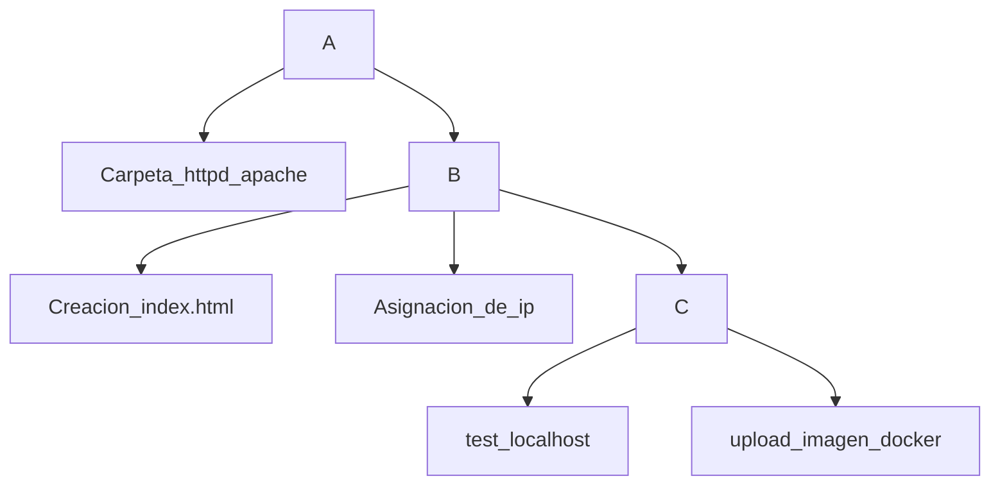

# Taller en Clase

Este repositorio contiene el desarrollo del taller realizado en clase.

## Integrantes del Grupo 7

|   Nombre     |   Apellido    |
| -------------| ------------- |
|   Michelle   |   Gutierrez   |
|   Harold     |   Ramirez     |
|   Camilo     |   Porras      |

# Diagrama de  diseño:

## Descripción

**1.**	Creación de una carpeta local con el nombre /apache-server-grupo-7/html

 

**2.**	Creación de un archivo de nombre index.html, con el contenido de la pagina.

 

 
**3.**	Creación del archivo Dockerfile.

 

**4.**	Construcción de la imagen apache-local con la etiqueta 1.0 haciendo relación a que es la primera versión del archivo.

 
**5.**	Asignación de una IP del segmento ip 10.0.2.0/24, en este caso la  ip 10.0.2.30

 
**6.**	Se accede a la ip en el navegador para confirmar el acceso a la pagina creada

 

**7.**	Se procede a conectarse a Docker Hub para subir la imagen

 

